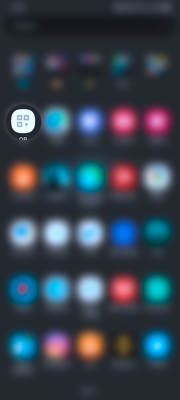
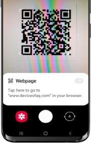

### Android
Cài đặt ứng dụng quét QR:

[https://play.google.com/store/apps/details?id=com.vnapps.qr](https://play.google.com/store/apps/details?id=com.vnapps.qr)

Mở ứng dụng để quét mã:

Với điện thoại Samsung hoặc Xiaomi có hỗ trợ sẵn quét QR từ Camera:

